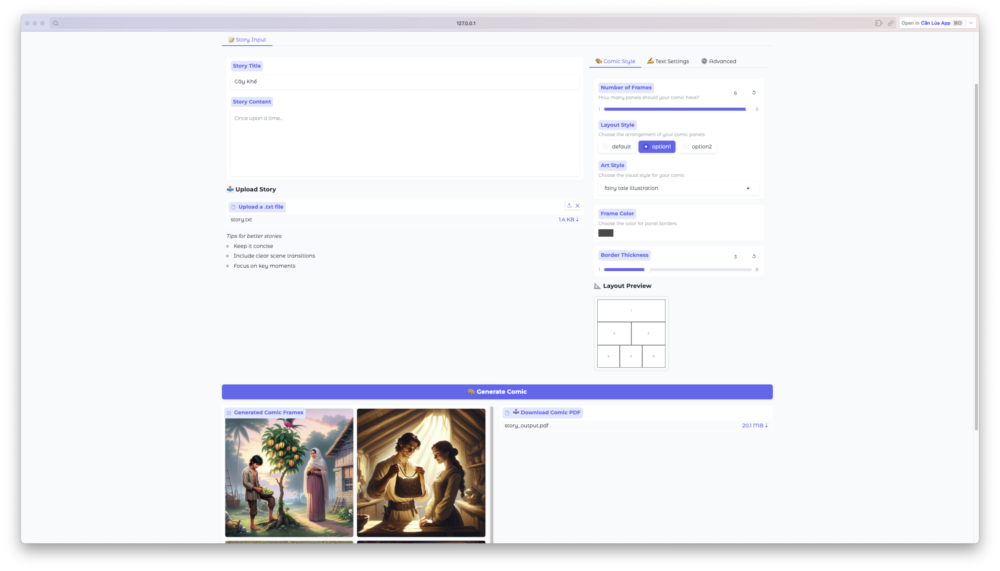
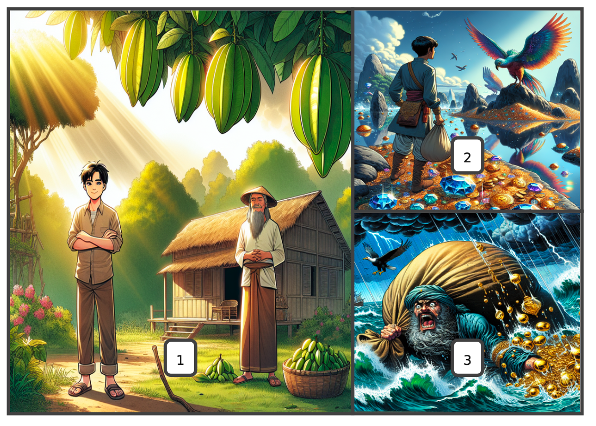

# Text to Comic Generator 🎨

## 📝 Introduction
Text to Comic Generator is a tool that allows users to convert text stories into beautiful PDF comics. The application integrates advanced language and image models to create a smooth creative experience.



## ✨ Key Features
- **Story Input**: Direct input or upload .txt file
- **Style Customization**: Choose from various artistic styles (comic, anime, fairy tale, realistic)
- **Flexible Layout**: Support for 1-6 frames with different layout styles
- **Text Customization**: Adjust font size and dialogue position
- **PDF Export**: Generate high-quality PDFs with images and story content

## 🚀 Installation
1. Install Python 3.x
2. Install required libraries:
```bash
pip install -r requirements.txt
```

## 🔑 Requirements
- OpenAI API Key for image generation
- Unicode Fonts (DejaVuSans or ArialUnicode) for multilingual support

## 💻 How to Use
1. Launch the application:
```bash
python ui.kt.py
```

2. User interface consists of 4 main tabs:
   - **📝 Story Input**: Enter content or upload file
   - **🎨 Comic Style**: Choose number of frames and style
   - **✍️ Text Settings**: Adjust font and position
   - **⚙️ Advanced Settings**: Customize layout and other options

## 📐 Custom Layouts
Supports JSON format for custom layouts. Examples:

### 3-Frame Layout:
```json
[
  [0, 0, 0.6, 1],
  [0.6, 0, 0.4, 0.5],
  [0.6, 0.5, 0.4, 0.5]
]
```



### 5-Frame Layout:
```json
[
  [0, 0, 0.6, 0.6],
  [0.6, 0, 0.4, 0.3],
  [0.6, 0.3, 0.4, 0.3],
  [0, 0.6, 0.3, 0.4],
  [0.3, 0.6, 0.7, 0.4]
]
```


## 🎯 Usage Notes
- Story files should be in .txt format with UTF-8 encoding
- Maximum support for 6 frames per page
- Ensure sufficient disk space for storing images and PDFs
- Check for stable internet connection for image generation

## 🛠️ Directory Structure
```
├── ui.kt.py              # Main user interface
├── mock_image_generation.py  # Mock image generation
├── image_generation.py   # Real image generation
├── prompt_template.py    # Prompt templates
├── Fonts/               # Font directory
└── images/              # Generated images directory
```